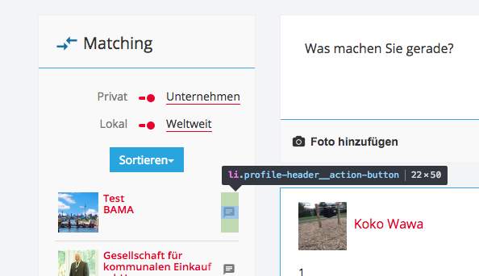
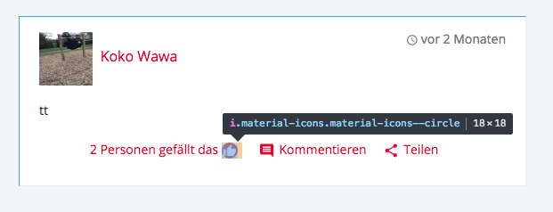
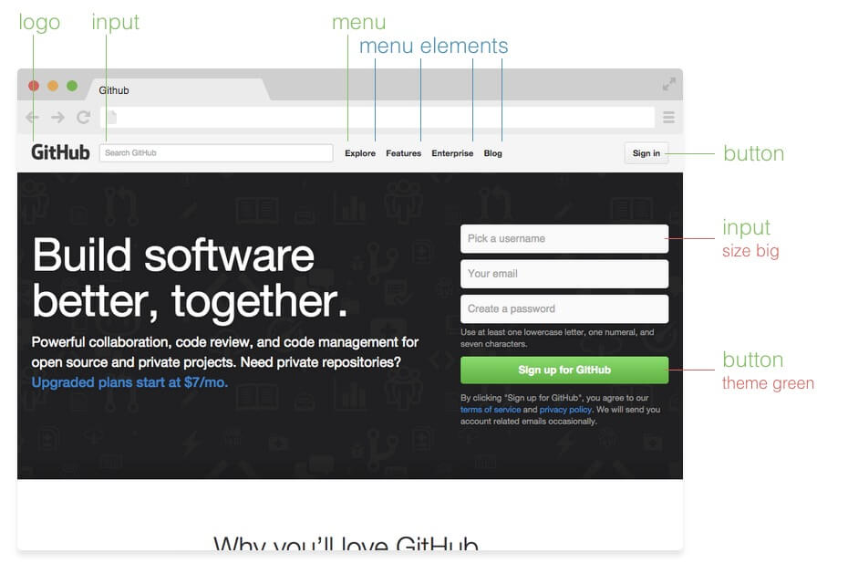
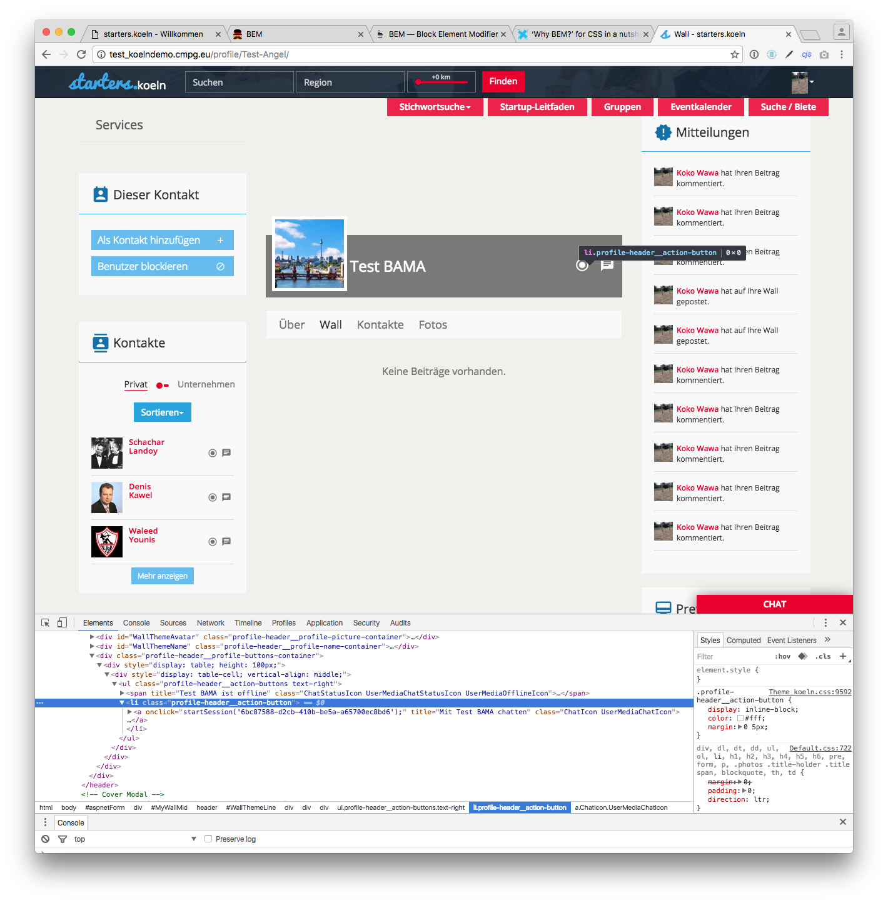

# BEM – Block Element Modifier

## Naming for CSS


> "There are only two hard problems in Computer Science: cache invalidation and naming things"  
>
> \- Phil Karlton


## What is BEM?

> "BEM is a highly useful, powerful and simple naming convention to make your front-end code easier to read and understand, easier to work with, easier to scale, [...]"
>
> \- http://getbem.com/


### So, what's BEM now, really?

BEM is a naming convention (not only) for css, which helps you to keep your code:

- more semantic
- reusable
- easier to understand


## Examples?

You probably saw a few things of BEM already in the *starters.koeln* Project:








## Concepts of BEM

- **Block**: Standalone entity that is meaningful on its own.
- **Element**: Parts of a block and have no standalone meaning. They are semantically tied to its block.
- **Modifier**: Flags on blocks or elements. Use them to change appearance or behavior.


### Example: Github Page




## Naming

- right styleguide
    - increase development speed, debugging and implementing new features
- without any structure and naming conventions
    - unmaintainable CSS codebase in the long term
- BEM
    - everyone speaks the same language. Using proper naming.


## Block

- standalone entity, meaningful on its own.
- can be nested / interact with each other
- semantically they remain equal
- no hierarchy


### Naming

Block names may consist of Latin letters, digits, and dashes:

> `.block`  
> `.this-is-a-long-block-name`


### HTML

Any DOM node can be a block if it accepts a class name.

```
<div class="block">...</div>
```

```
<div class="this-is-a-long-block-name">...</div>
```


### CSS

- Use class name selector only
- No tag name or ids
- No dependency on other blocks/elements on a page

```
.block {
  color: #042;
}
```


## Element

- Parts of a block
- no standalone meaning
- semantically tied to its block


### Naming

Element names may consist of Latin letters, digits, dashes and underscores. CSS class is formed as block name plus two underscores plus element name:

> `.block__elem`


### HTML

```
<div class="block">
  ...
  <span class="block__elem"></span>
</div>
```


### CSS

- Use class name selector only
- No tag name or ids
- No dependency on other blocks/elements on a page

**Good**

```
.block__elem {
  color: #042;
}
```

**Bad**
```
.block .block__elem {
  color: #042;
}

div.block__elem {
  color: #042;
}
```


## Modifier

Flags on blocks or elements. Use them to change appearance, behavior or state.


### Naming

CSS class is formed as block’s or element’s name plus two dashes

> `.block--mod`  
> `.block__elem--mod`  
> `.block--color-black`  
> `.block--color-red`


### HTML

- add to a block/element
- keep the original class

**Good**
```
<div class="block block--mod">
  ...
</div>

<div class="block block--size-big block--shadow-yes">
  ...
</div>
```

**Bad**
```
<div class="block--mod">
  ...
</div>
```


### CSS

Use modifier class name as selector:

```
.block--hidden { }
```

To alter elements based on a block-level modifier:
```
.block--mod .block__elem { }
```

Element modifier:
```
.block__elem--mod { }
```


### Example

```
<button class="button">
	Normal button
</button>
<button class="button button--state-success">
	Success button
</button>
<button class="button button--state-danger">
	Danger button
</button>
```


## Common Mistakes




```
.wall-widget--button__blue
```


## Further Reading

- http://getbem.com/
- [MindBEMding – getting your head ’round BEM syntax](http://csswizardry.com/2013/01/mindbemding-getting-your-head-round-bem-syntax/)
