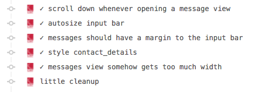
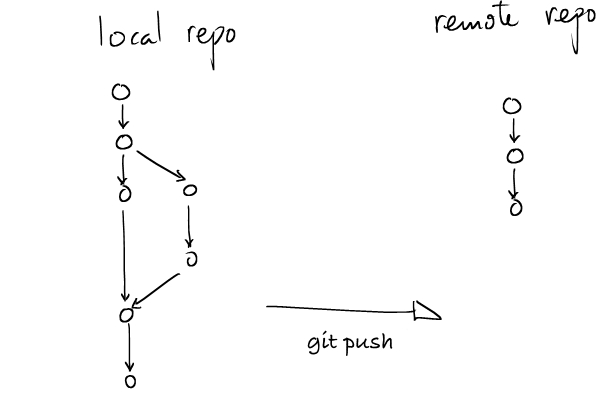

> "Git is a free and open source distributed version control system designed to handle everything from small to very large projects with speed and efficiency."<!-- .element: class="fragment" -->

## What will we talk about?

- Introduction: Centralized VS Distributed<!-- .element: class="fragment" -->
- The Concepts of Git<!-- .element: class="fragment" -->
- How to use Git in Visual Studio<!-- .element: class="fragment" -->

## Introduction
### **Centralized** VS **Distributed**

### TFS is **Centralized**

- `-` Single Point of Failure
- `-` Remote Commits
- `-` Save the whole Code-Base
- `+` File Locks

### Git is **Distributed**

- `-` No File Locks
- `-` Learning Curve(but..)
- `+` Save Only Differences
- `+` Makes Developer Braver
- `+` No Server Connectivity required

## The Concepts of Git

### Clone

> "Clones a repository into a newly created directory, creates remote-tracking branches for each branch in the cloned repository, and creates and checks out an initial branch that is forked from the cloned repository’s currently active branch."

<!-- .element: data-state="clone" -->
In easy words: Takes the whole repository...
<canvas id="clone-1"></canvas>

...and copies it to your location.
<canvas id="clone-2"></canvas>
<!-- .element: class="fragment" -->

<!-- .element: data-state="commit" -->
### Commit

> "You commit when you have reached a codebase state you want to remember."

<canvas id="commit-1"></canvas>

<!-- .element: data-state="branch" -->
### Branch

> "A branch represents an independent line of development."

<canvas id="branch-1"></canvas>

<!-- .element: data-state="merge" -->
### Merge

> "Merging is Git's way of putting a forked history back together again."

<canvas id="merge-1"></canvas>

<!-- .element: data-state="pull" -->
### Pull

> "Pull is an easy way to synchronize your local repository with upstream changes."

### Push

> "Pushing is how you transfer commits from your local repository to a remote repo."

## How to use Git in **Visual Studio**
